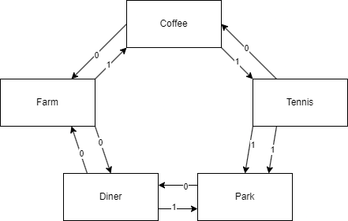
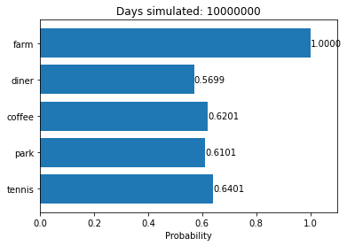

# Problem Description

Please solve the problem using a clear mathematical formulation, without any code.

**Summer with grandparents**

Alinah is spending the summer at her grandparents’ farm in a small town in Iowa. The town is known for frequent changes in its weather. Each day starts off as either sunny or rainy. There’s a 50% percent chance of each. The weather can switch up to once each day, but no one knows when. If it’s a sunny day, there’s a 30% chance that the weather turns from sunny to rainy. If it’s a rainy day, there’s a 50% chance that it switches from rainy to sunny. The weather resets at the beginning of each day.

Alinah decides what to do based on the weather. She starts her day at her grandparent’s farm. From the farm, she can go to the diner or to the coffee shop. If it’s sunny outside, she goes to the coffee shop. If it’s raining, she goes to the diner. From the diner, she can go back to the farm or to the park. If it’s sunny, she goes to the park. If it’s raining, she goes back to the farm. From the park, she can go to the diner or to the tennis court. If it’s sunny, she goes to the tennis court. If it’s raining, she goes to the diner. From the tennis court, she can go to the park or to the coffee shop. If it’s sunny, she goes to the park. If it’s raining, she goes to the coffee shop. From the coffee shop, she can go to the tennis court or back to the farm. If it’s sunny, she goes to the tennis court. If it’s raining, she goes back to the farm. Once she’s traveled five times, her grandparents pick her up and bring her back to the farm.

Alinah spent sixty days with her grandparents. How many of those days did she visit the diner at least once? What about the park, coffee shop, and tennis court?

# Solution

## Assumption

Since it says “The weather can switch up to once each day, but no one knows when”. I assume there is first the probability that the weather changes (30% chance if sunny, and 50% if rainy) and then a probability for when it changes (20% for each of the prior moments before the 5 movements).

## Notation

* **Weather:** Let $w$ represent the state of the weather, where $w=1$ when the weather is sunny, and $w=0$ when the weather is rainy.
* **Weather Change:** Let $c$ represent whether the weather will change on a given day, where $c=1$ indicates that the weather will change at some point, and $c=0$ indicates that the weather will not change. Therefore we cat state that $P(c|s)=0.3$ and $P(c|!s)=0.5$. Note that I'll use the $!$ symbol to invert a boolean.
* **When the weather changes** Let $t$ represent before which movement the weather changes. That is, if the weather will change on a given day, it changes before the $t$th movement. We can state that the probability that the weather changes on any given movement can be written as $p(t)=0.2$.

## Diner

The probability that Alinah visits the diner depends on the possible routes she can take. Since there are more ways to get to the diner than to avoid it, we'll start by calculating the probability that Alinah never visits the diner. We can then take the inverse of that probability for our solution.

* **Case 1:** The day starts sunny and the weather never switches. $p(s) \cdot p(!c|s)$ which is $0.5 * 0.7 = 0.35$
* **Case 2:** The day starts rainy, but the weather switches before Alinah makes the first move. If the weather switches any later, the first move places Alinah at the diner. $p(!s) \cdot p(c|!s) \cdot p(t=1)$ which is $0.5 \cdot 0.5 \cdot 0.2 = 0.05$
* **Case 3:** The day starts sunny and only switches before the last movement. If the weather switches any sooner, then Alinah has enough movements to get to the diner. $p(s) \cdot p(c|s) \cdot p(t=5)$ which is $0.5 \cdot 0.3 \cdot 0.2 = 0.03$

These probabilities together amount to $0.35 + 0.05 + 0.03 = 0.43$. This is the probability that Alinah will NOT visit the diner, therefore the inverse $1-p$ or $0.57$ or $\boldsymbol{57\%}$ gives us the probability that Alinah visits the diner at least once.

## Park

It's again easier calculate the inverse here. There are only three scenarios where Alinah cannot reach the park.

* **Case 1:** The day starts rainy and the weather never switches. $p(!s) \cdot p(!c|!s)$ which is $0.5 \cdot 0.5 = 0.25$
* **Case 2:** The day starts rainy, but the weather switches only before the last move. If the weather switches any sooner, then Alinah has enough moves to make it to the park. $p(!s) \cdot p(c|!s) \cdot p(t=5)$ which is $0.5 \cdot 0.5 \cdot 0.4 = 0.05$
* **Case 3:** The day starts sunny and the weather switches before the fourth move. It takes 4 moves to get to the park with sunny weather, so the weather must change before then. $p(s) \cdot p(c|s) \cdot p(t<4)$ which is $0.5 \cdot 0.3 \cdot 0.6 = 0.09$

These probabilities together amount to $0.25 + 0.05 + 0.09 = 0.39$ with $1-p=0.61$ or $\boldsymbol{61\%}$

## Coffee Shop

It's again easier to calculate the inverse, with again only three scenarios.

* **Case 1:** The day starts rainy and the weather never switches. $p(!s) \cdot p(!c|!s)$ which is $0.5 \cdot 0.5 = 0.25$
* **Case 2:** The day starts sunny, but the weather immediately switches to rainy. $p(s) \cdot p(c|s) \cdot p(t=1)$ which is $0.5 \cdot 0.3 \cdot 0.2 = 0.03$
* **Case 3:** The day starts rainy and the weather switches before the second or fourth move. These even numbered switches are required as Alinah must be at the Diner which the switch occurs in order to avoid the coffee shop. $p(!s) \cdot p(c|!s) \cdot p(t=2,4)$ which is $0.5 \cdot 0.5 \cdot 0.4 = 0.1$

These probabilities together amount to $0.25 + 0.03 + 0.1 = 0.38$ with $1-p=0.62$ or $\boldsymbol{62\%}$

## Tennis Court

* **Case 1:** The day starts rainy and the weather never switches. $p(!s) \cdot p(!c|!s)$ which is $0.5 \cdot 0.5 = 0.25$
* **Case 2:** The day starts sunny and the weather switches sometime before the third move. $p(s) \cdot p(c|s) \cdot p(t<3)$ which is $0.5 \cdot 0.3 \cdot 0.4 = 0.06$
* **Case 3:** The day starts rainy and the weather switches before the last move. $p(!s) \cdot p(c|!s) \cdot p(t=5)$ which is $0.5 \cdot 0.5 \cdot 0.2 = 0.05$

These probabilities together amount to $0.25 + 0.06 + 0.05 = 0.36$ with $1-p=0.64$ or $\boldsymbol{64\%}$

# Simulations

To confirm that we have the correct answers here, we can run a simulation based on the outlined rules.

Looks like the math is correct!
